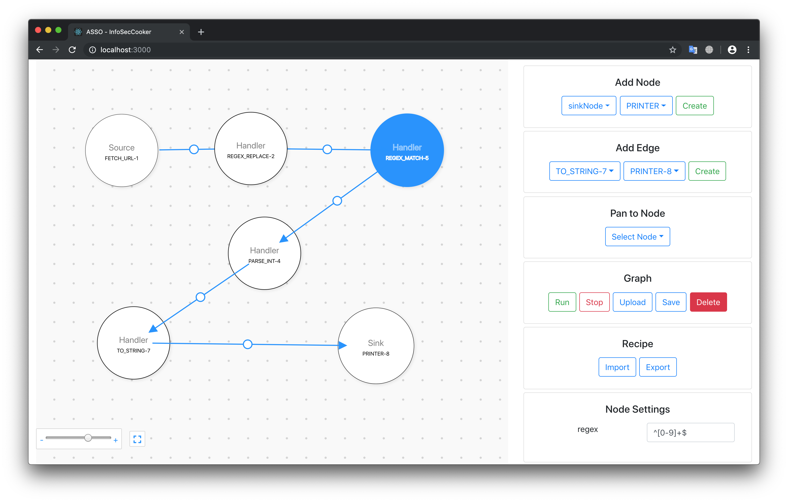
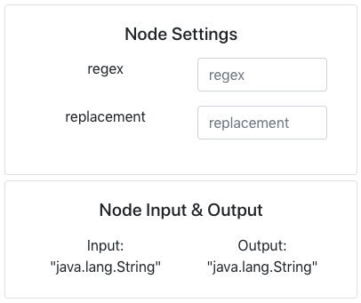

# InfoSecCooker
Project aimed at supporting the creation and execution of arbitrary Information Security Recipes.



## Guidelines
The base unit of computation is a **Task**.
Tasks are comprised of a set of a set of **inputs**, a set of **outputs**, and an inherent **behavior**.
**Recipes** can be composed by arbitrarily connecting Tasks’ inputs/outputs (as long as the respective types are compatible).
The application should be **extensible**, and support new Tasks without changing the base code.
Recipes can be **saved** and **reused** as Tasks on other recipes (composition).

## Technologies
 - Backend: Java, chosen for its excellent standard library (data-structures, multi-threading, ...);
 - Frontend: JavaScript + React, chosen for its ease of use and extensive use cases online.

## Architecture
### Pipes and Filters
We chose to employ the **Pipes-and-Filters** architecture (_architectural pattern_), as this snugly fits our requirements (in fact, the pattern’s goals are perfectly aligned with this project’s goals). This architecture allows us to decompose a task into a series of separate and reusable elements, with the added advantage of ensuring separate elements can operate in isolation and scale independently (only communicating through the use of message _pipes_).
This architecture consists of the following basic components:
_Sources_, which act as data sources, and thus take no inputs;
_Sinks_, which act as data targets, and thus have no outputs;
_Filters_ (or _Handlers_), which transform or _filter_ the data they receive via the _pipes_ (perform operations on said data);
_Pipes_, which act as connectors that pass data between all the other components; thus, _pipes_ are a directional stream of data that (in our implementation) are implemented by a data buffer (a limited-capacity queue), in order to ensure flexibility and leeway between different components.
This network of interconnected components form a _Graph_, with the _Sources_/_Sinks_/_Filters_ acting as Nodes of the Graph, and the _Pipes_ acting as its edges. This Graph represents our _Recipe_.

**Related classes:** Node, Source, Sink, Handler.


### Publisher-Subscriber
In a lower-level of abstraction, we employ the **Publisher-Subscriber** pattern for exchanging messages between Nodes of the Graph. This enables a message producer (_Publisher_) to announce events to multiple interested consumers (_Subscriber_s) asynchronously, without coupling the message senders to their receivers.

Furthermore, the messaging subsystem includes an outbound queue for each Producer, as well as an inbound queue for each Subscriber (both queues are implemented as a limited-capacity _BlockingQueue_). These exchange of messages is mediated by a **Message Broker**, which is responsible for copying messages from one outbound queue to all subscribers’ inbound queues (all subscribers are offered a copy of the published message).

**Related classes:**
* Publisher and Subscriber interfaces.
* The Source class implements Publisher; the Sink class implements Subscriber; and the Handler class implements both Publisher and Subscriber.
* Broker, Registry, MessageEvent, and EntityQueue.


#### A couple details
To facilitate extensibility and ease the process of finding common resources, we employ the **Registry** pattern.
Every time a new client (be it publisher or subscriber) registers on the Broker’s Registry, he is granted a unique identifier and a queue. If the client is a _Publisher_ it will be used to post messages. If the client is a _Subscriber_ it will be used to receive subscribed messages.
In this way, new subscribers and publishers must only conform to the set known interfaces and register themselves on the Broker in order to be found by other services.

Additionally, when a Publisher publishes a message on its queue it must notify the Broker. The message-arrival-event carries a **message hash** and, optionally, a **time-to-live**, that ensure data _integrity_ and _validity_. On its own thread, and in a completely parallelizable manner, the _Broker_ handles all message-arrival-events asynchronously, and messages whose time-to-live has expired are discarded.


##### Back pressure
A Consumer whose queue is full discards its oldest message when offered a new message. Additionally, if the number of consumers at maximum capacity is high, it indicates that the rate at which messages are being produced is too high for the subscribers to handle.

If a certain threshold of “at-capacity” consumers is surpassed (currently set at 50%), **back-pressure** is applied to the respective publisher by decreasing the capacity of its outbound queue. This way, the signal can pass from the consumers to the producers, providing adaptability to each other’s rate of message production.


##### Sources, Handlers, and Sinks
The building blocks of our _Recipes_ are its independent Nodes. Sources are message publishers; Sinks are message consumers; and Handlers are both consumers and publishers (filtering/transforming the message in-between).

Each node has **Inbound and Outbound types**, which must be compatible with its connected neighbours.
Also, each node has a set of **settings**, which are configurable by the user (_e.g._ a file-reader’s path, or a regex-matcher’s expression).



Multiple nodes/functionalities are already implemented (including arithmetic operators, logical operators, type converters, regex matchers, ...). Additionally, if you want to **extend** these with your own implementations you must only inherit from the Source/Handler/Sink superclasses, and register your new node on the **NodeFactory** (can be done in a static manner, does not require holding a reference to the factory).


### Client-Server
The system was implemented with a client-server architecture. A React application was used for the client side and a Java application for the backend side. The client side has several features related to the graph: create different sorts of nodes (sources,handlers,sinks), create edges between existing nodes, move the camera to a certain node, save the current graph state, load a previously created graph, run the graph and generate recipes. The backend side uses an HTTP server, supported by Java, to deal with client requests. Some of the routes that were implemented are:
/node-types - GET request which provides the client side with the entire list of different nodes.
/checkEdge - POST request used when validating an edge creation. Checks if a certain node type can be connected to another one.
/sendGraph - POST request used to send the client’s graph to the backend.
/runGraph - POST request used to run the graph algorithm.
/stopGraph - POST request used to stop the graph algorithm.


### Other Design Patterns
Factory - Used in the backend while creating the Sources/Sinks and Handlers which are subclasses of the abstract class Node.
Strategy - Used on the different Sources/Sinks and Handlers algorithms. StringGenerator, FileReader and FetchUrl are some of the algorithms that are encapsulated in the Source’s strategy behaviour.
Composite - Used when dealing with imported Recipes. These are groups of handler nodes linked together to achieve a certain goal. By using the composite we can treat the entire recipe as a single Node.
Builder - Used on the creation of the graph by separating its construction from its representation, allowing different graphs generated by the same process. 
Memento - Used to save the graph’s state, allowing to restore to that state later. It was also used during the creation of recipes for the same reason.
Template method - The _Handler_ abstract class cedes the .handleMessage(...) function to be implemented by its subclasses; the _RollingOp_ handler cedes its .executeRollingOp(...) to be implemented by its subclasses; as well as several other abstract methods used when needed.


## Along the way; “in the end, it’s the journey that matters”

We had initially implemented the base pipes-and-filters architecture in _TypeScript_ / _Javascript_, but quickly found ourselves severely limited due to its lacking (or lack of) multi-threaded support, as well as reference standard libraries (_e.g._ for BlockingQueues). With this in mind, we decided to migrate all the code to Java, which implicated the development of a separate front-end module.
For the front-end module, we decided to use _JS_+_React_ (with the help of [Uber’s digraph component](https://github.com/uber/react-digraph)).


## Implemented Nodes
Although easily extensible, we provide several already implemented nodes representing core functionalities of any recipe.

### Sources
 - FETCH_URL - Fetches a resource, given its URL
 - FILE_READER - Takes a file and reads its lines
 - INTEGER_GENERATOR - Outputs pseudo random integers
 - STRING_GENERATOR - Outputs a random set of characters

### Handlers
 - AND - Performs the logical AND operation
  - IF - Checks a message’s boolean value, returning null (no message) in case it is false
 - MD5_HASH - Calculates a string’s hash using the MD5 algorithm
 - OR - Performs the logical OR operation
 - PARSE_FLOAT - Parses a floating point value currently represented as non-numeric
 - PARSE_INT - Parses an integer value currently represented as non-numeric
 - PAIRWISE_PRODUCT - Calculates pairwise product between consecutive numbers
 - REGEX_MATCH_BOOL - Tests a message against a regular expression
 - REGEX_MATCH - Similar to the above, returning the message itself if there is a match and null otherwise
 - REGEX_REPLACE - Replaces part of a message with a regular expression filter
 - ROLLING_AVERAGE - Given a window size, performs the average of its values once size is hit
 - ROLLING_SUM - Given a window size, performs the sum of its value once size is hit
 - TO_STRING - Parses a value to a string value
 - TO_UPPERCASE - Parses a message’s content to uppercase characters
 - XOR - Performs the logical exclusive or operation

### Sinks
 - FILE_WRITER - Outputs a message to a file
 - PRINTER - Prints a message to the console


## Q&A
### Who initiates the flow? The senders? The receivers?
The senders start the flow by starting by producing messages and sending them to their queue which, in turn, through a broker, is sent to the subscribers. However, when 50% of the receivers have the queue full and cannot process more messages, a back pressure mechanism is applied in which the sender's queue is reduced to reduce the workload of the publisher.


### Where does the (temporary) information live while waiting to be processed? 
The information lives in outbound and inbound queues, which are mediated by the Broker as described in the previous sections.

### Can we execute tasks in parallel? Are there dependencies?
Tasks can be (and indeed are) executed in parallel. Each node’s execution is isolated, and thus only communicate with each other through the aforementioned pipes.


### Is the communication blocking?
Yes, communication is blocking.

Publishers/Producers push messages into their ProducerQueue (a _BlockingQueue_ with a set capacity), and block when this queue is full. This indicates that either no Consumer is subscribed, or messages are being produced in a faster rate than they can be consumed (in this case, back pressure may be applied).

Subscribers/Consumers take messages from their ConsumerQueue (a _BlockingQueue_ with a set capacity), and block when this queue is empty. This way, the Consumer can cede hardware resources when it’s not processing any messages.

The Broker moves messages from the Producers’ queues into the queues of the respective subscribed Consumers. This is done on its own thread, and can easily be further parallelized as the Broker’s EventQueue is also a thread-safe _BlockingQueue_ (multiple threads can process these message events).


### Are all tasks connectable? Can we avoid mistakes? 
Only tasks with compatible types are connectable. In our java implementation, each Node has Generic Input and Output **types**. As such, the system does not allow connecting two nodes with incompatible outbound/inbound types. In addition, we check for any **cycles** on the graph, if the two tasks that are being connected are the same or if the edge ends in a Source or begins in a Sink (both invalid).


### How do we handle errors? Logging? Debugging?
Initially, the graph is validated by type-checking all edges (connections between message producers and consumers), as well as the nodes’ settings (_e.g._ a file-reader must have its _path_ setting set).

During runtime, the system logs possible errors and warnings in a message that contains the time and the thread from where the error occurred. However, errors on any node are an isolated occurrence, and do not inherently affect other nodes.


### Input as lists of things v.s. element by element? 
Element by element, and in the arithmetic or other handlers that need more than one input the number of inputs expected to process is specified and, after that, an array with the processed result is returned. 


### When does it stop?
Our implementation stops after the stop command (accessible by a button on the front-end client).


## Design Review
The architecture satisfies the original guidelines/goals, while maintaining modularity and obeying the open-closed principle.


## Running
Start the backend server:
```
cd backend/jar
java -jar backend.jar
```

Start the frontend client:
```
cd frontend
npm i
npm start
```

## Team 
  **Elements:**
- André Cruz [@AndreFCruz](https://github.com/AndreFCruz)
- Diogo Torres [@diogotorres97](https://github.com/diogotorres97)
- Filipe Lemos [@FilipeFLemos](https://github.com/FilipeFLemos)
